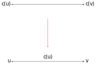
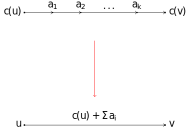
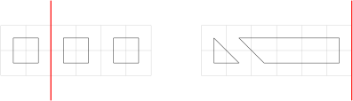

# 2021全國資訊學科能力競賽 解說（NHSPC2021 Editorial）

---

## A - barbershop

有 n 個人一起來店，第 i 個人的服務時間為 t<sub>i</sub>。每個客人等待時間是前面人 + 自己服務時間總和，求等待時間總和的最小值。

例如：三個人服務時間為 2,1,3，若服務順序為 1,2,3 則等待時間總和為 2 + (2+1) + (2+1+3) = 11。

----

等價題序：給一個陣列 t := {t<sub>1</sub>, t<sub>2</sub>, …, t<sub>n</sub>}，將 t 重新排列使得 nt<sub>1</sub> + (n-1)t<sub>2</sub> + (n-2)t<sub>3</sub> + … + t<sub>n</sub> 最小。

由上式不難得知，順序越前面被乘的係數就越大，所以可以貪心地將數字從小排到大。複雜度 O(n log n)。

---

## B - bus

給定由 n 條線段組成的折線 $\mathbf{P} := \left\\{ \overline{P_i P_{i+1}} \right\\}_{i=1}^n$ 與一點 O，問 O 到 P 的最短距離。

----

先考慮這個問題：給定一線段 $\overline{PQ}$ 與一點 O，求 O 到 $\overline{PQ}$ 的距離。
首先我們作 O 到 $\overline{PQ}$ 的垂足 H，並試著計算 $\overline{OH}$。
注意 $\overline{OH}$ 其實就是 ΔOPQ 以 $\overline{PQ}$ 為底時的高，所以可以用下面的方法計算：

```
Length_OH(O: Point, PQ: Segment):
    A ← ΔOPQ
    return 2A/|PQ|
```

ΔOPQ 可以用 [Shoelace formula](https://en.wikipedia.org/wiki/Shoelace_formula) 計算。

----

但事情沒有這麼簡單。
O 到 $\overline{PQ}$ 的距離並不總是 $\overline{OH}$：
當 ∠OPQ 或 ∠OQP 為鈍角時，H 並不在 $\overline{PQ}$ 上，而此時的最短距離是 $\overline{OP}$ 或 $\overline{OQ}$。
由畢氏定理可知，∠OPQ 為鈍角的充要條件是 $\overline{OP}^2 + \overline{PQ}^2 < \overline{OQ}^2$，
因此 O 到 $\overline{PQ}$ 間的距離就可以用下面的方法計算：

```
Distance(O: Point, PQ: Segment):
    if |OP|^2 + |PQ|^2 < |OQ|^2 then
        return |OP|
    else if |OQ|^2 + |PQ|^2 < |OP|^2 then
        return |OQ|
    else
        return Length_OH(O, PQ)
    end if
```

代入 $\overline{PQ} = \overline{P_1P_2}, \overline{P_2P_3}, \ldots, \overline{P_nP_{n+1}}$ 並取最小值就是答案。

---

## C - busker

給一張 n 點（城市） m 邊的有向圖 G<sub>0</sub>。
我們對 G<sub>0</sub> 的每條邊都加上 k 個點（村莊），得到一張 n + mk 節點的有向圖 G，並賦予點權重 c: V(G) → Z（每個節點的收支）。

設 C 是 G 上的一個簡單環且 u ∈ V(C)。
若從 u 出發沿著 C 走一圈，任意前綴點權重和（所持金）都 ≥ 0，我們就說 C 是 G 的一個**好環**，而 u 是 C 的一個**好起點**。

請找出 G 的任一個好環 C 與 C 的任一個好起點 u，並求出 C 上有幾個點可以當作好起點，這些好起點又有幾個在 G<sub>0</sub> 上。

----

### 非負環必可以找到好起點

顯然一個好環有點權重和 ≥ 0。我們證明若一個環的點權重和 ≥ 0，則它必定是一個好環（i.e. 可以找到一個好起點）。

設 C 是一個點權重和 ≥ 0 的環。隨意找一個 u<sub>1</sub> ∈ V(C)，並設從 u<sub>1</sub> 沿著 C 出發走一圈經過的點依序是
u<sub>2</sub>, u<sub>3</sub>, …, u<sub>\|V(C)\|</sub>。
對於所有的 i ∈ {0, 1, …, \|V(C)\|}，考慮在每個節點的所持金數列 s（也就是環的點權前綴和）：

$\begin{align}s(i) = \begin{cases}0,&\text{if }i=0,\\\ c(u_1) + c(u_2) + \ldots + c(u_i),&\text{if }i\ge1.\end{cases}\end{align}$

考慮路途任一所持金最小的時刻 k ∈ {0, 1, …, \|V(C)\| - 1}，也就是 k 滿足

$\begin{align}s(k) = \min_{0 \le i \le \|V(C)\| - 1} s(i).\end{align}$

注意我們有 s(\|V(C)\|) ≥ 0 = s(0)，因此

$\begin{align}s(k) = \min_{0 \le i \le \|V(C)\|} s(i).\end{align}$

----

接著證明 u<sub>k + 1</sub> 是一個好起點。

對於所有的 i ∈ { k + 1, k + 2, …, \|V(C)\| }，
從 u<sub>k + 1</sub> 出發沿著 C 走到 u<sub>i</sub> 的點權重和是 s(i) - s(k)，
但 s(k) ≤ s(i)，
故 s(i) - s(k) ≥ 0。

對於 i ∈ {1, 2, …, k}，
從 u<sub>k + 1</sub> 出發沿著 C 走到 u<sub>i</sub> 的點權重和是 s(\|V(C)\|) + s(i) - s(k)。
但 s(\|V(C)\|) ≥ 0，依然有 s(\|V(C)\|) + s(i) - s(k) ≥ s(i) - s(k) ≥ 0。

----

### 非負環求好起點的數量

到前面為止，已經證明了任意一個非負環必定存在一個好起點（也就是題目所求的入能敷出演藝路線）。
這裡假設讀者已經很熟悉 O(VE) [找負環的技巧](https://konaeakira.github.io/posts/using-the-shortest-path-faster-algorithm-to-find-negative-cycles.html)。

接著來處理題目的另一個詢問，也就是環上共有幾個好起點。

----

方法 1：DP

定義 s 的前綴最小值 α<sub>i</sub> 為 u<sub>1</sub> 沿著 C 走到 u<sub>i</sub> 時的最小所持金：

$\begin{align}\alpha_i = \min_{0 \le k \le i} s(i).\end{align}$

類似地，我們也可以定義 s 的後綴最小值 β：

$\begin{align}\beta_i = \min_{i \le k \le \|V(C)\|} s(i).\end{align}$

若改變起點從 u<sub>x</sub> 開始沿著 C 走一圈，可以推出所持金最小的時刻如下:

- u<sub>x</sub> 至 u<sub>\|V(C)\|</sub> 間：β<sub>x</sub> - s(x - 1)
- u<sub>1</sub> 至 u<sub>x-1</sub> 間：α<sub>x - 1</sub> + s(\|V(C)\|) - s(x - 1)
- 上面兩者取最小值即可求得以 u<sub>x</sub> 為起點繞 C 走一圈的最小所持金

由於環展開頂多只有 n + mk 個節點，故這邊複雜度為 O(n + mk)。

----

方法 2：

不失一般性假定 k = 0，亦即任意時間所持金皆非負，對於所有的 i 皆有 s(i) ≥ 0。
接著證明 u<sub>i</sub> 是好起點 ⟺ s(i-1) ≤ s(j) for all j ∈ {i, i+1, …, \|V(C)\|}。

1. 若 j ≥ i，從 u<sub>i</sub> 沿著 C 走到 u<sub>j</sub> 的點權重和是 s(j) - s(i-1)，
故 ⇒ 是直接結論。
1. 若 j < i，從 u<sub>i</sub> 沿著 C 走到 u<sub>j</sub> 的點權重和變成 s(\|V(C)\|) + s(j) - s(i-1)，
    又因為 s(j) ≥ 0，我們有

    s(\|V(C)\|) + s(j) - s(i-1) ≥ s(\|V(C)\|) - s(i-1) ≥ 0，

這給出了 ⇐ 的證明，因此只要找出了一個非負環，就能在 O(\|C\|) = O(n + mk) 時間求出所有的好起點。

----

### Subtask 1: n ≤ 20

直接建立 G，注意我們有 \|V(G)\| = n + mk = O(n<sup>3</sup>) 且 \|E(G)\| = m(k+1) = O(n<sup>3</sup>)。
對於每條邊 (u, v)，轉移權重 c(u)：



我們用 Bellman-Ford 演算法找出一個非負環，時間複雜度為 O(\|V(G)\|\|E(G)\|) = O(n<sup>6</sup>)。

----

### Subtask 2: n ≤ 90

在 Subtask 1 中，Bellman-Ford 的節點更新次數只要達到 n，就找到一個非負環了，故時間複雜度進一步降成 O(n\|E(G)\|) = O(n<sup>4</sup>)。

----

### Subtask 3: n ≤ 2000, m ≤ 8000

我們建圖的目的是找出好環，所以可以在 G<sub>0</sub> 上找出非負環 C<sub>0</sub>，復原成 C 後再找出好起點。
設 (u, v) ∈ E(G<sub>0</sub>) 且在 G 上被加入的點權重分別是 a<sub>1</sub>, a<sub>2</sub>, …, a<sub>k</sub>，
則我們直接轉移權重 c(u) + Σa<sub>i</sub> 到 (u, v) 上：



如此一來 Bellman-Ford 的時間就降為 O(mn)。

---

## D - car

給一張 n 點 m 邊的有向圖，每條邊都可以反轉，但反轉第 i 條邊需要權限 c<sub>i</sub>，反轉複數條邊所需的權限值就是反轉邊的最大權限。

問至少要有多少權限才可以將邊反轉使得整張圖沒有環？並輸出反轉方案。

----

### Subtask 1: n,m ≤ 20

可以枚舉要反轉邊的 subset，之後再檢查環有沒有被刪掉。

----

### Subtask 2: c<sub>i</sub> ≤ 100

答案 = 選的邊裡的最大權重，直接枚舉這個數字 x，代表可以將權限 x 以下的所有邊做任意反轉操作。

至於要怎麼求出方案以及判斷 x 是否是可行解，這裡提供一個方法：

1. 首先將 ≤ x 的所有邊刪除，做 > x 邊的拓樸排序。
2. 由於 ≤ x 的邊可以任意改動方向，我們就改動邊的方向來符合上個步驟求出的拓樸順序。

在決定 x 以後可以花 O(n + m) 的時間檢查並求出可行解，複雜度是 O(c(n + m))。

----

### Subtask 3: n,m ≤ 10<sup>5</sup>, c<sub>i</sub> ≤ 10<sup>9</sup>

在 subtask 2 中我們已經知道了枚舉一個解的權限值判斷是否可行的方法。可以發現，若枚舉的解越大，可以改動的邊越多，也更有可能存在可行解，存在單調性。

因此我們可以將 subtask 2 中枚舉權重的部分改成二分搜尋，在 O((n + m) log c) 的時間做完。
當然也能先將邊權 c<sub>1</sub>, …, c<sub>m</sub> 排序，再對排序後的 c<sub>i</sub> 們做二分搜，時間複雜度進一步降成 O((n+m) log m)。

---

## E - colosseum

有座 n 層樓的競技場，其中第 i 層開設時間、金幣枚數門檻、挑戰費時、結束後獲得金幣枚數分別為 x<sub>i</sub>, y<sub>i</sub>, t<sub>i</sub>, w<sub>i</sub>。
參賽者初始擁有的金幣枚數為 0，但可以從任一層開始挑戰。在抵達第 i 層時：

- 若已擁有 ≥ y<sub>i</sub> 枚金幣且抵達時間 < x<sub>i</sub>，可以選擇等待競技開始或直接進入第 i+1 層
- 若已擁有 ≥ y<sub>i</sub> 枚金幣且抵達時間 ≥ x<sub>i</sub> 就一定要花 t<sub>i</sub> 時間參加競技
- 否則只能直接進入第 i+1 層

請問參賽者在時間 m 時能獲得的最大金幣數量是多少？本題 n ≤ 300000 且 1 ≤ w<sub>i</sub> ≤ 1000。

----

### Subtask 2: x<sub>i</sub> = y<sub>i</sub> = 0

用兩個 pointer 來模擬 queue，找出在 t<sub>i</sub> 區間和不超過 m 的情況下，w<sub>i</sub> 區間和的最大值，時間複雜度是 O(n)。

----

### Subtask 3: x<sub>i</sub> = 0

由於每一層只要達到門檻數量的金幣就會發生戰鬥，可以用一個 queue Q 來儲存金幣數 f 與時間 s，並依序考慮第 1 層到第 n 層。

加入第 i 層時，先把 (0, 0) 插入 Q 的後端，接著將 f ≥ y<sub>i</sub> 的 (f, s) 們全部加上 (w<sub>i</sub>, t<sub>i</sub>)，最後再從 Q 的前端踢掉 s > m 的那些 (f, s) 們。
可以得到一個 O(n<sup>2</sup>) 時間複雜度的做法，再用 [Fenwick tree](https://en.wikipedia.org/wiki/Fenwick_tree) 進一步加速到 O(n log n)。

----

### Subtask 1: n ≤ 1000

在金幣數相同的情況下，可以知道時間比較早的不會比較差。
我們用一個 hash map M 來儲存金幣數 f (key type) 與時間 s (mapped type)，並依序考慮第 1 層到第 n 層。
加入第 i 層時，先加入 (0, 0) 至 M 中，接著對於 M 裡所有滿足 f ≥ y<sub>i</sub> 的 (f, s) 數對，做下面這件事情：

1. 若 s ≥ x<sub>i</sub>，則把 (f, s) 踢掉，並根據 s + t<sub>i</sub> 是否超過 m 決定要不要加入 (f + w<sub>i</sub>, s + t<sub>i</sub>) 至 M 中。
2. 否則，根據 x<sub>i</sub> + t<sub>i</sub> 是否超過 m，決定要不要加入 (f + w<sub>i</sub>, x<sub>i</sub> + t<sub>i</sub>) 至 M 中。

\|M\| 最大為 Σw<sub>i</sub> + 1，總共做 n 次，時間複雜度為 O(n Σw<sub>i</sub>)。

----

### 滿分做法（並沒有）

在驗題的過程中，我們誤以為時間越早金幣越多越好，但這是不正確的。
考慮 m = 10、x = {0, 0, 3, 0, 0}、y = {0, 0, 10, 110, 0}、t = {1, 1, 1, 5, 5}、w = {100, 10, 1, 1, 1000}。

最佳解是從第 2 層出發，第 3 層等待，最後得到的 1011 枚金幣（這時離開第 3 層的時間與金幣數分別為 4 與 11）。
另一方面，若從第 1 層出發且第 3 層不等待，則離開第 3 層的時間與金幣數分別為 2 與 110，看似比前者為優，但因過了 y<sub>4</sub> = 110 的門檻被強迫參加第 4 層的競技，最後只能拿到 111 枚金幣。

基本上這種測試資料需要特別構造。
由於比賽時的測資是隨機生成的，在我們的機器上平行跑了時間複雜度 O(n Σw<sub>i</sub>) 的解 12 小時後終於確認比賽時的輸入輸出都是對的，只是這個執行時間根本不可能過得了時限。

---

## F - fruit

- 一開始船上有 c 個種類的水果，第 i 種類有 n<sub>i</sub> 顆
- 依序經過 c 個城市，每經過一個城市可以決定要不要把船上**所有前 i 種類**的水果給當地盤商賣
- 積載每顆水果經過都市 i 需要積載成本 p<sub>i</sub>
- 把每顆水果給都市 i 的盤商賣需要成本 s<sub>i</sub>
- 在都市 i 賣種類 j 的水果最後只會賣出 r<sub>i,j</sub> 顆

問若積載成本和銷售成本總和不超過 T 的前提下，最多能賣幾顆水果？限制：

* 1 ≤ c, n<sub>i</sub> ≤ 40
* 1 ≤ p<sub>i</sub>, s<sub>i</sub> ≤ 1000
* T ≤ 10<sup>7</sup>

----

### Subtask 1: c ≤ 20, T ≤ 30000

直接枚舉所有可能的銷售都市集合，組合數為 Ω(2<sup>c</sup>)。

----

### Subtask 2: T ≤ 30000

考慮 DP 狀態 dp[i][j]：

- i 是最後一次卸貨給盤商銷售的城市（=賣出最大的水果種類）
- j 是到城市 i 卸貨為止前 i 種類水果積載 + 銷售的費用和
- dp[i][j] 為最後一次在城市 i 卸貨，前 i 種水果總花費 j 時最大賣出的水果數量
- 特殊地，若 i=0 則代表尚未卸貨

----

枚舉 i 的上一個卸貨點 k（0 ≤ k < i）：

- 最後一次卸貨所卸的水果種類為 k+1 至 i，令 N = 船上 k+1 至 i 的水果數量和
- 最後一次卸貨產生的銷售費用為 N * s<sub>i</sub>
- 水果 k+1 至 i 產生的積載費用為 N * (p<sub>1</sub> + p<sub>2</sub> + … + p<sub>i</sub>)
- 此次卸貨，在此城市將賣出 r<sub>i, k+1</sub> + r<sub>i, k+2</sub> + … + r<sub>i, i</sub> 顆水果

可以注意到上面的轉移式中，n, s, p, r<sub>i</sub> 的和都可以用前綴和來 O(1) 求出。
因此只要輸入時先預處理這些數列的前綴和，便可以做到狀態 O(cT) 轉移 O(c) 的 DP，時間複雜度為 O(c<sup>2</sup>T)。

----

### 滿分做法

因為 T 的範圍太大不適合拿來當狀態，只好試著想辦法用水果數量來構造對偶狀態。
考慮 DP 狀態 dp[i][j]:

- i 是最後一次卸貨給盤商銷售的城市（=賣出最大的水果種類）
- j 是到城市 i 為止前 i 種類水果銷售數量和
- dp[i][j] 為最後一次在城市 i 卸貨，前 i 種水果銷售量 j 時所花的最小成本
- 特殊地，若 i=0 則代表尚未卸貨

----

轉移和上面 O(c<sup>2</sup>T) 的作法極為類似，
分別列出每次卸貨所產生的積載、銷售成本以及銷售量轉式會很清楚因此就不多加贅述了。
答案為滿足 dp[i][j] ≤ T 最大可能的 j。

整體的複雜度分析：

- 水果數量為 Σn<sub>i</sub> 個，狀態數 O(c Σn<sub>i</sub>)
- 轉移 O(c)
- 因此 DP 的時間複雜度為 O(c<sup>2</sup> Σn<sub>i</sub>)

---

## G - pineapple

給定一棵有根樹，一開始每條邊權重都是 1，處理下列兩種操作：

1. 把某條邊的權重變 0。
2. 詢問根節點到某一節點的權重和。

詢問數和節點數都是 10<sup>5</sup> 等級。

----

### Subtask 2

Root 的度數為 1，且其他節點度數最多為 2 ⇒ 給的樹是一條 path。

這筆 subtask 可以用一棵 BIT 或線段樹來維護每條邊的權重，詢問等價於求序列前綴和。複雜度是 O(n log n)。

----

### 滿分做法

假設某筆詢問將邊 (x, y) 由 1 改成 0，其中 x 是父節點。這個操作相當於將子樹 y 的答案都減 1。
每次的操作都是一個子樹操作，因此我們可以先計算初始答案，並將樹的時間戳記用來做線段樹的 index，即可在每次操作 O(log n) 的時間維護訊息。

這個技巧一般被稱作 [Euler Tour Technique](https://usaco.guide/gold/tree-euler?lang=cpp) 或者俗稱樹壓平。
對此技巧不熟悉的可以在上面連結或相關關鍵字找到資料。

---

## H - puipui

對於一個數列 $\mathbf{a} = a_1, a_2, \ldots, a_k$，定義 $f(\mathbf{a})$ 為

$\begin{align}\max_{1 \le i \le k} \left\| a_{(i\operatorname{mod}k)+1} - a_i \right\|. \end{align}$

上式和題目所求的環狀數列最大高度差等價。
現在給定 $n$ 個數 $h_1, h_2, \ldots, h_n$，想要從裡面抓出 $p$ 個 $k$ 項的數列 $\mathbf{a_1}, \mathbf{a_2}, \ldots, \mathbf{a_p}$（當然我們有 $n\ge pk$）。請問

$\begin{align}\max_{1\le i\le p}f(\mathbf{a_i})\end{align}$

的最小值是多少？

----

### Subtask 2: k=n, p=1

不失一般性，假定 $h_1 \le h_2 \le \ldots \le h_n$。
經過亂嘗試以後我們發現似乎只要把奇數項從小排到大，再把偶數項從大排到小，就能給出最佳解。
（至於為什麼亂試會得到這個結論，就留給讀者自行思考了 [窩不知道.jpg]）

為了接下來的討論方便，以下給出一些定義：

1. 一個 $\sigma \in S_n$ 是 $1, 2, \ldots, n$ 的排列，我們寫成 $\sigma = \sigma(1), \sigma(2), \ldots, \sigma(n)$，
    一個例子是 $\sigma = 1, 3, 5, 4, 2$。
2. $\sigma\|_i$ 為「從 $\sigma$ 去掉所有 $>i$ 的數後得到的 $1, 2, \ldots, i$ 排列」。
    例如當 $\sigma = 1, 3, 5, 4, 2$ 時，$\sigma\|_3$ 就是 $1, 3, 2$。
3. 對於所有的 $\tau \in S_i$，定義 $g(\tau; \mathbf{h})$ 為

    $\begin{align}\max_{1 \le j \le i} \left\| h_{\tau((j\operatorname{mod}i)+1)} - h_{\tau(j)} \right\|. \end{align}$

    白話一點解釋，$g(\tau; \mathbf{h})$ 代表的是將前 $i$ 隻老鼠以 $\tau$ 排成環狀數列所得的最大高度差。
    在本 subtask 中，我們要找出 $\sigma \in S_n$ 使得 $g(\sigma; \mathbf{h})$ 有最小值。
4. 定義
    $$\begin{align}\sigma^* = \begin{cases}1, 3, \ldots, n-2, n, n-1, n-3, \ldots, 2,& \text{if }n\text{ is odd}, \\\
    1, 3, \ldots, n-3, n-1, n, n-2, \ldots, 2,&\text{if }n\text{ is even}.\end{cases}\end{align}$$

可以發現當 $n \ge 2$ 時，$\sigma^\*\|_{n-1}$ 和 $n \gets n-1$ 時的 $\sigma^\*$ 完全相同。

----

我們用數學歸納法證明 $\sigma^\*$ 會給出最小的 $g(\sigma; \mathbf{h})$。
對於 $n \le3 $，$g(\sigma; \mathbf{h}) = h_n - h_1$，在 n 是 3 以下的情況確實為最佳解。
若 $n \ge 4$ 並考慮把 $n$ 插入 $\sigma^\*\|_{n-1}$ 以得到 $\sigma^\*$ 的過程。
由於 $n$ 被插入 $n-2$ 和 $n-1$ 中間且 $n-1$ 和 $n-3$ 相鄰，我們知道

$\begin{align} g(\sigma^{\*}\|\_{n-1}; \mathbf{h}) \ge h_{n-1} - h_{n-3} \ge h_{n-1} - h_{n-2}. \end{align}$

另一方面，對於任意 $\sigma \in S_n$，我們本來就有

$$\begin{align}\begin{cases} g(\sigma; \mathbf{h}) \ge h_n - h_{n-2}, \\\
g(\sigma; \mathbf{h}) \ge g(\sigma|_{n-1}; \mathbf{h}). \end{cases}\end{align}$$

所以可以分兩種情況：

1. $g(\sigma^{\*}\|\_{n-1}; \mathbf{h}) < h_n - h_{n-2} \Rightarrow g(\sigma^{\*}; \mathbf{h}) = h_n - h_{n-2}$，
    故 $\sigma^{\*}$ 為最小的 $g(\sigma; \mathbf{h})$。
2. $g(\sigma^{\*}\|\_{n-1}; \mathbf{h}) \ge h_n - h_{n-2} \Rightarrow g(\sigma^{\*}; \mathbf{h}) = g(\sigma^{\*}|\_{n-1}; \mathbf{h})$，
    根據歸納法假設知道 $\sigma^*$ 也會最小化 $g(\sigma; \mathbf{h})$。

只要先將 $\mathbf{h}$ 排序好，就能在 O(n) 時間內得出答案，時間複雜度為 O(n log n)。

----

### Subtask 3: p = 1

一樣先將 $\mathbf{h}$ 排序好，接著再用 [sliding window](https://stackoverflow.com/questions/42138771) 在 $O(n)$ 時間內得出答案，時間複雜度與 subtask 2 相同。

----

### 滿分做法

直接對答案 $x$ 做二分搜，判斷是否能切出 $\ge p$ 個 $k$ 項的數列 $\mathbf{a}$ 滿足 $f(\mathbf{a})\le x$。時間複雜度為 O(n log n + n log H)，其中 $H$ 是 $h_i$ 的最大值。

---

## I - rail

給定 L，問 2×L 方格能放幾個不相交的迴圈使得所有方格中心都被經過，且每個迴圈最多只能有 1 條斜邊。

----

令 D<sub>i</sub> 為 L=i 時的方法數。對於任何一張合法的圖，我們從左邊到右邊找出第一個不會切到迴圈的鉛直線：



可以發現若鉛直線切出的寬度是 l 與 i-l，
則被切出 l 的那邊有 2l - 3 種填滿的方式，這樣一來我們就有

$\begin{align} D_i = \sum_{j=0}^{i-2} (2(i-j)-3) D_j. \end{align}$

----

### Subtask 1: L ≤ 7

直接帶入遞迴式計算，時間複雜度是指數級。

----

### Subtask 2: L ≤ 1000

根據前面所介紹的遞迴式依序計算 D<sub>0</sub>, D<sub>1</sub>, …, D<sub>L</sub>，
並用一個 DP 表格記錄算過的 D<sub>i</sub> 們，需時 O(L<sup>2</sup>)。

----

### Subtask 3: L ≤ 10<sup>5</sup>

整理遞迴式

$$\begin{align}\begin{split} D_i &= \sum_{j=0}^{i-2}(2(i-j)-3)D_j \\\
  &= \sum_{j=0}^{i-2} (2i-2j-3) D_j \\\
  &= (2i-3) \sum_{j=0}^{i-2} D_j - 2 \sum_{j=0}^{i-2} j D_j. \end{split}\end{align}$$

令 $A_i := \sum_{j=0}^i D_j$ 以及 $B_i := \sum_{j=0}^i j D_j$，則上式可以進一步寫成

$$\begin{align} A_i - A_{i-1} = (2i-3) A_{i-2} - 2B_{i-2}.\end{align}$$

加上 $B_i = B_{i-1} + i(A_i-A_{i-1})$ 這個條件，即可在 $O(L)$ 時間內算出 $D_L = A_L - A_{L-1}$。

----

### Subtask 4: L ≤ 10<sup>10</sup>

我們再度化簡遞迴式：

$\begin{align}D_i = (2i-3) \sum_{j=0}^{i-2} D_j - 2 \sum_{j=0}^{i-2} j D_j, \end{align}$
$\begin{align}D_{i-1} = (2i-5) \sum_{j=0}^{i-3} D_j - 2 \sum_{j=0}^{i-3} j D_j.\end{align}$

將兩式相減得到

$$\begin{align}\begin{split} D_i - D_{i-1} &= (2i-3)D_{i-2} + 2 \sum_{j=0}^{i-3} D_j - 2(i-2)D_{i-2} \\\
  &= D_{i-2} + 2\sum_{j=0}^{i-3} D_j, \end{split}\end{align}$$

因此

$\begin{align} D_i - D_{i-1} - D_{i-2} = 2 \sum_{j=0}^{i-3} D_j,\end{align}$
$\begin{align} D_{i-1} - D_{i-2} - D_{i-3} = 2 \sum_{j=0}^{i-4} D_j.\end{align}$

----

再度將兩式相減得到

$D_i - 2D_{i-1} + D_{i-3} = 2D_{i-3},$

故有

$\begin{align} D_i = 2D_{i-1} + D_{i-3}. \end{align}$

這是個線性遞迴式。搭配初始條件 $D_0 = 1, D_1 = 0, D_2 = 1$，則對於所有的 $L \ge 3$，皆有

$$
  \begin{align}\begin{pmatrix}
  D_L \\\
  D_{L-1} \\\
  D_{L-2}
  \end{pmatrix} = \begin{pmatrix}
  2 & 0 & 1 \\\
  1 & 0 & 0 \\\
  0 & 1 & 0 \end{pmatrix}
  \begin{pmatrix}
  D_{L-1} \\\
  D_{L-2} \\\
  D_{L-3} \end{pmatrix} = \begin{pmatrix}
  2 & 0 & 1 \\\
  1 & 0 & 0 \\\
  0 & 1 & 0 \end{pmatrix}^{L-2} \begin{pmatrix}
  1 \\\
  0 \\\
  1 \end{pmatrix}.\end{align}
$$

利用[快速冪](https://en.wikipedia.org/wiki/Exponentiation_by_squaring)，即可在 O(log L) 時間內得出答案。
